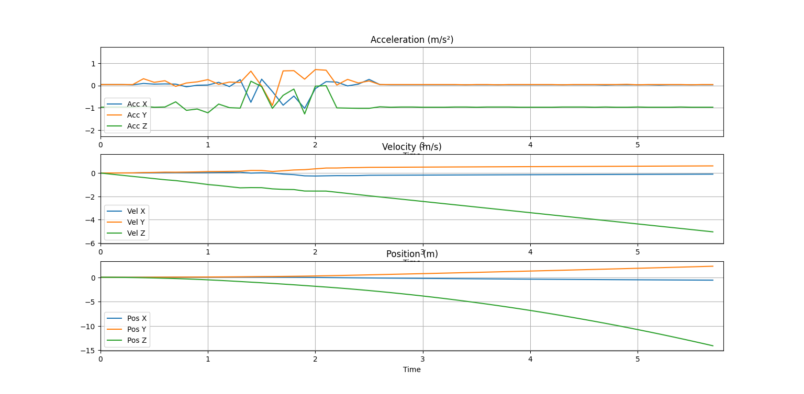
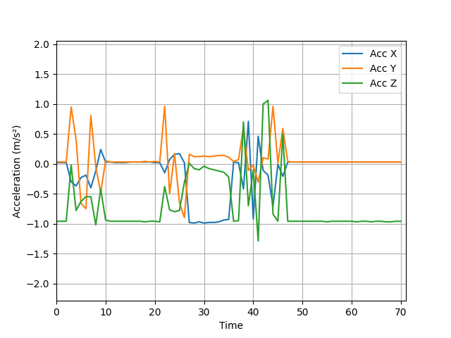
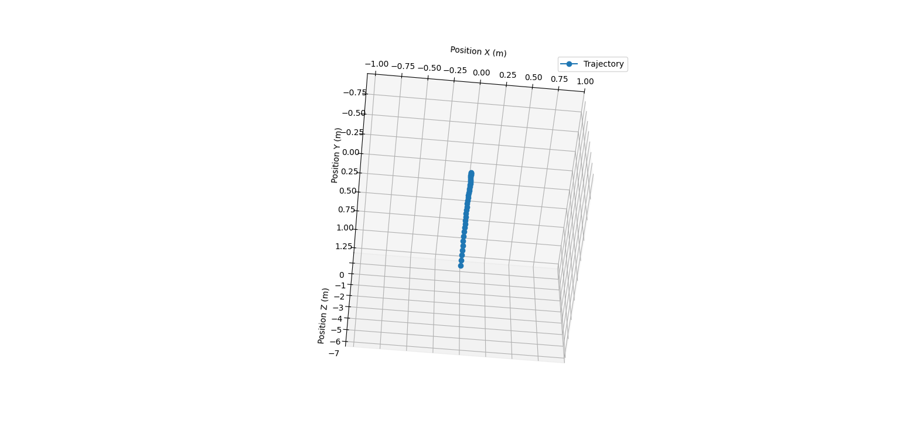

# Real-Time 2D/3D Position Plotter

This project provides a Python-based application for real-time 2D position plotting, utilizing data received from a serial port, such as from an Arduino or other microcontroller. The program calculates and visualizes the trajectory of a moving object based on acceleration data.

## Features

- Real-time plotting of 2D trajectories.
- Parses acceleration data (X, Y, Z) from a serial input.
- Implements basic physics equations to calculate position and velocity.
- Dynamic graph updates with an adjustable window of data points.

## Requirements

- Python 3.6 or higher
- Libraries:
  - `serial` (for reading from the serial port)
  - `matplotlib` (for plotting)

## Setup

1. Clone this repository:

   ```bash
   git clone <repository-url>
   ```

2. Navigate to the project directory:

   ```bash
   cd real-time-plotter
   ```

3. Install the required dependencies:

   ```bash
   pip install pyserial matplotlib
   ```

## Some Results:
<b> 3D trajectory

<br />
Acceleration,Velocity and Position in X Y and Z dirn

<br />
Acceleration vs Time while rotating the 9 Axis Imu-9250

<br />
XYZ plot trajectry tracking 


<br />
While moving in a Sinosudal curve </b>


## Usage

1. Connect your microcontroller (e.g., Arduino) to your computer and note its COM port.

2. Update the `ser` configuration in the code to match your COM port and baud rate:

   ```python
   ser = serial.Serial('COM12', 115200, timeout=1)  # Replace 'COM12' with your port
   ```

3. Run the script:

   ```bash
   python asdf.py
   ```

4. Observe the real-time 2D trajectory plot updating dynamically based on the input data.

## Data Format

The script expects the incoming serial data to be in the following format:

```
Acc: X,Y,Z
```

Where `X`, `Y`, and `Z` are floating-point acceleration values.

### Example Input

```
Acc: 0.05, -0.02, 0.10
```

## Code Overview

- **Serial Configuration**: Sets up the serial port for communication.
- **Data Parsing**: Extracts acceleration values from the serial input.
- **Physics Calculations**: Computes velocity and position using acceleration and time interval.
- **Real-Time Plotting**: Updates a dynamic 2D plot of the object's trajectory.

## Customization

- Adjust the plot range by modifying these lines:
  ```python
  ax.set_xlim(-1000, 1000)  # X-axis range in cm
  ax.set_ylim(-1000, 1000)  # Y-axis range in cm
  ```
- Change the number of displayed points by updating:
  ```python
  if len(x_pos) > 200:  # Keep only the last 200 points
  ```

## Stopping the Script

To terminate the program, press `Ctrl + C` in the terminal.

## Troubleshooting

- **No data displayed**: Ensure the microcontroller is correctly sending data in the expected format.
- **Serial port error**: Check if the correct COM port is specified.

## License

This project is licensed under the MIT License. Feel free to use, modify, and distribute the code.

---


# ESP32_Motion_Detector
This Arduino code reads sensor data from an MPU6050 sensor connected to an ESP32 microcontroller board.


Acceleration: Movement along the X, Y, and Z axes (in g-force)
Rotation: Angular velocity around the X, Y, and Z axes (in degrees per second)
This code:

Initializes serial communication between the ESP32 and your computer at a baud rate of 115200.
Initializes the MPU6050 sensor and checks for successful connection.
Continuously reads sensor data in a loop:
Acceleration on the X-axis (g-force)
Rotation (gyroscope) on the X-axis (degrees per second)
Prints the sensor readings to the serial monitor.
Applications:

This code can be a starting point for various projects that utilize motion sensing, such as:

Motion detection: Detect movement or orientation changes.
Balance and stability applications: Monitor tilt and balance.
Gesture recognition: Recognize specific movements based on sensor data.
Data logging: Record sensor data for analysis.
Note:

This code currently only reads and prints data from the X-axis for acceleration and gyroscope. You can modify it to access data from all three axes (X, Y, Z).
Feel free to modify and extend this code for your specific project requirements!
<br>
Setup done
<br>


Some resuls on Wokwi
<br>
1.
<br>

<br>
<br>
2.
<br>

<br>
<br>
<br>
Applications:

This code can be a starting point for various projects that utilize motion sensing, such as:

Motion detection: Detect movement or orientation changes.
Balance and stability applications: Monitor tilt and balance.
Gesture recognition: Recognize specific movements based on sensor data.
Data logging: Record sensor data for analysis.
<br>
<br>
Note:

This code currently only reads and prints data from the X-axis for acceleration and gyroscope. You can modify it to access data from all three axes (X, Y, Z).
Feel free to modify and extend this code for your specific project requirements!
